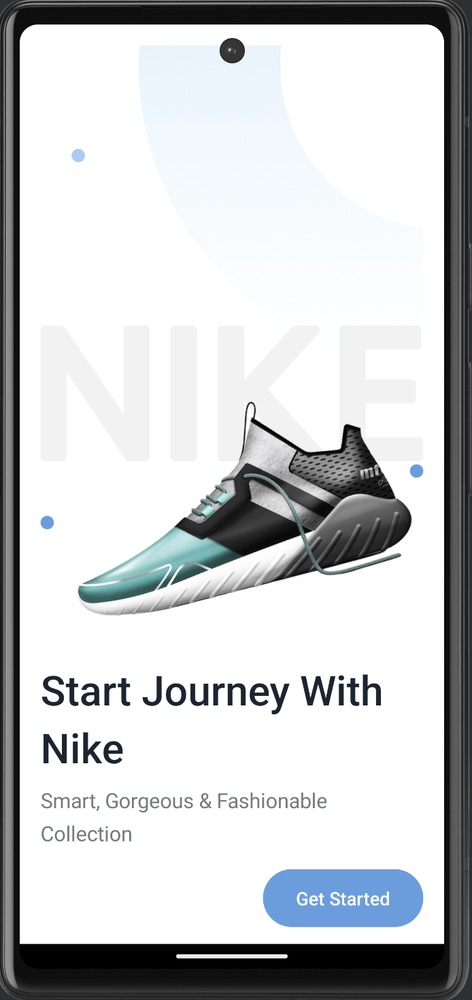
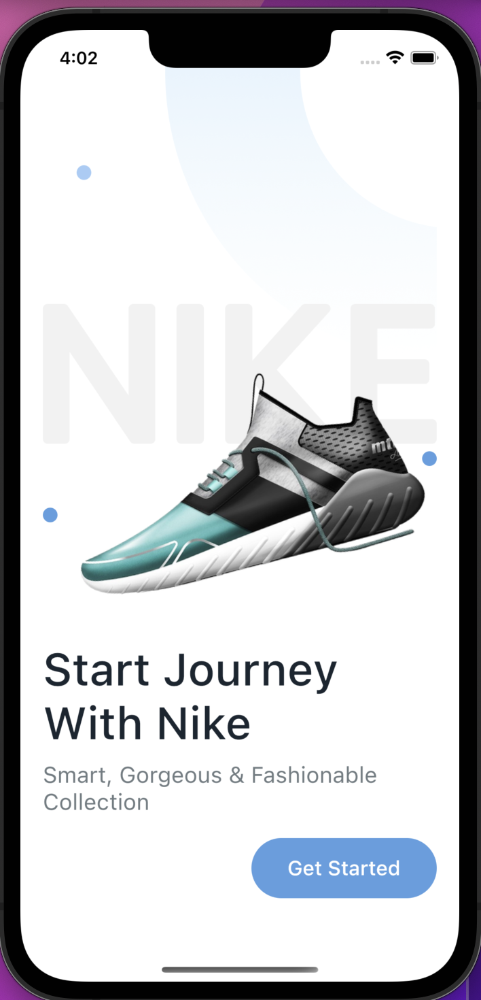
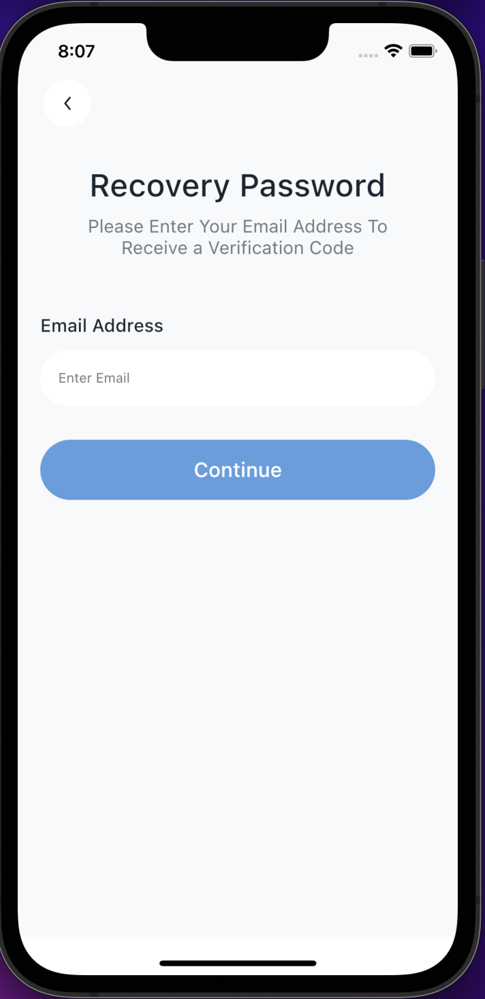

## ShoesKMP - Multiplatform Shoes App

  <p align="left"> A Shoes app built using Compose Multiplatform for Android and iOS </p>

  <p align="left">
      <a href = "https://github.com/JetBrains/compose-multiplatform/releases">
        
      </a>
      <a href="https://kotlinlang.org/docs/releases.html">
        
      </a>
  </p>

### ⚠️⚠️ _WORK IN PROGRESS_ ⚠️⚠️

### ⚒️ Architecture

ShoesKMP follows the principles of Clean Architecture.

### 👨‍💻 Tech stack

| Tools          |                                    Link                                     |
|:---------------|:---------------------------------------------------------------------------:|
| 🤖  Language   |                      [Kotlin](https://kotlinlang.org)                       |
| 🩶  Framework  | [Compose Multiplatform](https://www.jetbrains.com/lp/compose-multiplatform) |
| 💉  DI         |         [Koin](https://insert-koin.io/docs/reference/koin-mp/kmp/)          |
| 🧭  Navigation |        [Tlaster / PreCompose](https://github.com/Tlaster/PreCompose)        |

### 🖥️ Screenshots

#### Android

<table style="width:100%">
  <tr>
    <th>OnBoarding</th>
<th>Login</th>
<th>Register</th>
<th>Forget Password</th>
  </tr>
  <tr>
    <td></td>
 <td></td>
 <td></td>
 <td></td>
  </tr>
</table>

#### IOS

<table style="width:100%">
  <tr>
    <th>OnBoarding</th>
<th>Login</th>
<th>Register</th>
<th>Forget Password</th>
  </tr>
  <tr>
    <td></td>
<td></td>
<td></td>
<td></td>

  </tr>
</table>

### How to run the project? ✅

To run this project, you need the following:

* A machine running a recent version of macOS
* [Xcode](https://apps.apple.com/us/app/xcode/id497799835)
* [Android Studio](https://developer.android.com/studio)
*

The [Kotlin Multiplatform Mobile plugin](https://plugins.jetbrains.com/plugin/14936-kotlin-multiplatform-mobile)

### Check your environment

Before you start, use the [KDoctor](https://github.com/Kotlin/kdoctor) tool to ensure that your
development environment is configured correctly:

1. Install KDoctor with [Homebrew](https://brew.sh/): ``brew install kdoctor``

2. Run KDoctor in your terminal: ``kdoctor``

   If everything is set up correctly, you'll see valid output:

   ```text
   Environment diagnose (to see all details, use -v option):
   [✓] Operation System
   [✓] Java
   [✓] Android Studio
   [✓] Xcode
   [✓] Cocoapods
   
   Conclusion:
     ✓ Your system is ready for Kotlin Multiplatform Mobile development!
   ```

Otherwise, KDoctor will highlight which parts of your setup still need to be configured and will
suggest a way to fix them.

## Want to start with fresh Kotlin-MultiPlatform Project

* [Goto Kotlin MultiPlatform Wizard , it will create a fresh project , download it ,and import it in your android studio, Run in both android and IOS ](https://kmp.jetbrains.com/?_gl=1*xbev41*_ga*NDMwNjQ1NjU1LjE2ODU0NjU2Mzk.*_ga_9J976DJZ68*MTY5OTg1NTg2My43LjEuMTY5OTg1NTk2OC4xNS4wLjA.&_ga=2.197527980.248806873.1699855864-430645655.1685465639)

## Find this project useful ? ❤️

- Support it by clicking the ⭐️ button on the upper right of this page. ✌️

# License

```markdown
Copyright 2023 Jayant Kumar

Licensed under the Apache License, Version 2.0 (the "License");
you may not use this file except in compliance with the License.
You may obtain a copy of the License at

http://www.apache.org/licenses/LICENSE-2.0

Unless required by applicable law or agreed to in writing, software
distributed under the License is distributed on an "AS IS" BASIS,
WITHOUT WARRANTIES OR CONDITIONS OF ANY KIND, either express or implied.
See the License for the specific language governing permissions and
limitations under the License.
```
